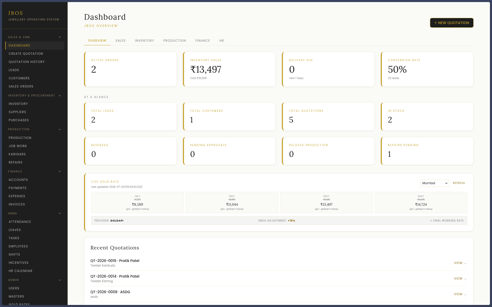
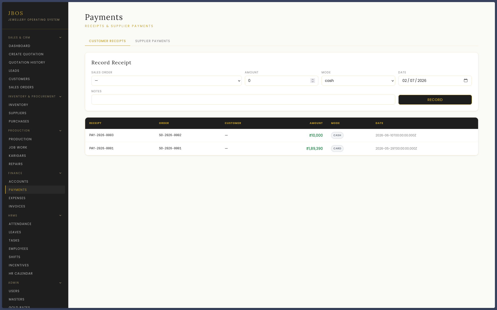
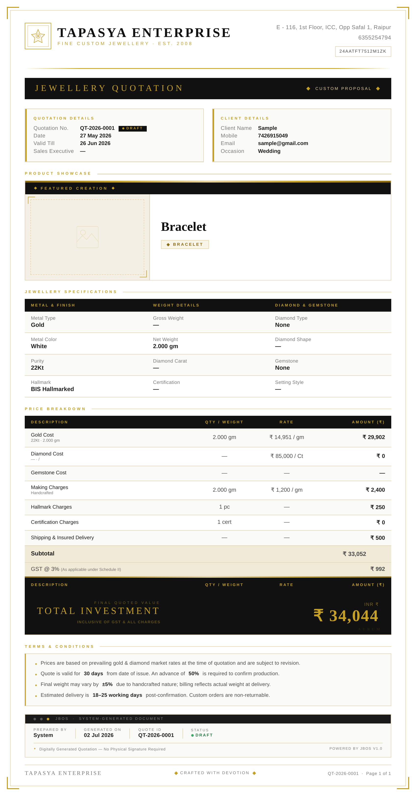

<div align="center">

# 💎 JBOS

### Jewellery Business Operating System

**The operating system for modern jewellery businesses — from the first quotation to the general ledger.**


[**Live Demo**](#-live-demo) · [**Features**](#-features) · [**Architecture**](#-architecture) · [**Getting Started**](#-getting-started) · [**Roadmap**](#-roadmap)

</div>

---

## 🔗 Live Demo

> A hosted instance is available. It is login-protected — use the demo account below to explore with sample data.

<div align="center">

[**▶ Open Live Demo**](https://jbos-client.onrender.com/)

</div>

| | |
|---|---|
| **URL** | https://jbos-client.onrender.com/ |
| **Email** | `demo@sales123.com` |
| **Password** | `demosales` |

> _Seeded with dummy data — please don't store real customer information in it. The instance runs
> on a free tier, so the first request after inactivity may take ~50 seconds to wake up._

---

<div align="center">
  
</div>

---

## ✨ Why JBOS

Most jewellery businesses run on a patchwork of Excel sheets, WhatsApp messages, and printed
forms. Pricing is done by hand, quotations look inconsistent, customer history lives in someone's
memory, and the books are reconciled at the end of the month — if at all.

**JBOS replaces all of that with one system.** It started by solving the most painful problem —
turning manual, error-prone quotations into structured, professional **luxury quotation PDFs**
backed by a real pricing engine (gold weight × live rate, diamond/gemstone carats, making
charges, GST) — and grew into an end-to-end platform that runs the whole business: winning
customers, running the workshop, tracking stock, managing the team, and keeping the books.

Built for **Indian jewellers** — INR formatting, GST-aware pricing, live gold-rate management
with India markup, and WhatsApp delivery of quotations to customers.

---

## 🧩 Features

JBOS is organised into modules that mirror how a jewellery business actually operates.

### 📝 Quotations
Structured quotation builder with a live pricing engine, one-click **A4 PDF generation**
(rendered by headless Chromium from a luxury HTML template), product image / CAD render upload,
per-quote pricing snapshots, and searchable history.

### 🤝 CRM
Lead pipeline with follow-ups, automatic **lead → customer conversion** when a quotation is
raised, customer timelines, reminders, deduplication, and KPI tracking.

### 👥 HRMS
Employees, attendance, leaves, shifts, tasks, incentives, an HR calendar, and a per-employee
document vault — a payroll-ready people-operations layer.

### 📦 Inventory & Procurement
Inventory items with stock movements, supplier management, and purchase orders.

### 🏭 Manufacturing
The jewellery workshop, digitised: **sales orders → production jobs → karigar (artisan) job
work → repairs**, tracked end to end.

### 📒 Finance & Accounting
A real **double-entry ledger** — chart of accounts, balanced journal enforcement, payments,
expenses, invoices, and a finance dashboard (revenue, receivables, payables, cash position).

### 🛠️ Admin & Access Control
User management, company settings, master data, and gold-rate override — all behind
**role-based access control**.

### 📊 Analytics & Audit
Cross-module dashboard aggregates plus a tamper-evident audit trail of key actions.

### 🔌 Integrations
- **PDF engine** — Puppeteer (headless Chromium) renders print-perfect A4 quotations.
- **Live gold rates** — scheduled cron fetch with configurable India markup.
- **WhatsApp** — send quotations and documents to customers via the Meta Graph API.

---

## 🛠 Tech Stack

| Layer | Technology |
|-------|-----------|
| **Frontend** | React 18 · Vite 5 · Tailwind CSS 3 · React Router 6 · Axios |
| **Backend** | Node.js (ESM) · Express 4 |
| **Database** | PostgreSQL (Neon) — raw SQL via `postgres.js`, no ORM |
| **Auth** | JWT (`jsonwebtoken`) + bcrypt · role-based access control |
| **PDF engine** | Puppeteer (headless Chromium) |
| **Scheduling** | `node-cron` (live gold-rate fetch) |
| **Uploads** | Multer (images / CAD renders / documents) |
| **Deployment** | Render (client + API) · Neon (database) |

---

## 🏗 Architecture

```
                    React SPA  (Vite · Tailwind · :5173)
                          │  /api and /uploads proxy
                          ▼
                    Express API  (JWT + RBAC · :5000)
                          │
        ┌─────────────────┼───────────────────────────────┐
        ▼                 ▼                                 ▼
  Neon PostgreSQL   Service layer                     Integrations
  (raw SQL,         (pricing · finance ·        ┌─── Puppeteer → A4 PDF
   ~49 tables)       CRM · HRMS · …)            ├─── HTML template renderer
                                                ├─── Gold-rate cron + India markup
                                                └─── WhatsApp (Meta Graph API)
```

Persistence uses a single shared Postgres connection pool with SSL and advisory-lock–guarded
boot (safe across multiple Render replicas). The schema and idempotent migrations are applied at
startup. See [`docs/ARCHITECTURE.md`](docs/ARCHITECTURE.md) for the detailed design.

---

## 🚀 Getting Started

### Prerequisites
- **Node.js 18+** and npm
- A **PostgreSQL** database connection string (a free [Neon](https://neon.tech) database works great)

### 1. Install dependencies (root + client + server)

```bash
npm install
npm run install:all
```

### 2. Configure the server environment

```bash
cp server/.env.example server/.env
```

Edit `server/.env` — at minimum set `DATABASE_URL` and a `JWT_SECRET` (≥ 32 characters).
See [Configuration](#-configuration) below.

### 3. Initialise the database

```bash
npm run db:init
```

> On first boot the API also applies the schema, runs idempotent migrations, and seeds the
> initial admin, master data, employees, and chart of accounts automatically. The admin login
> comes from `SEED_ADMIN_EMAIL` / `SEED_ADMIN_PASSWORD` in your `.env`.

### 4. Run the dev servers

```bash
npm run dev
```

- **Client** → http://localhost:5173
- **API** → http://localhost:5000/api/health

---

## ⚙️ Configuration

Environment variables live in `server/.env` (backend) and `client/.env` (frontend).

**Core**

| Variable | Required | Description |
|----------|:---:|-------------|
| `DATABASE_URL` | ✅ | Postgres/Neon connection string (SSL required) |
| `JWT_SECRET` | ✅ | JWT signing secret, **≥ 32 characters** |
| `PORT` | | API port (default `5000`) |
| `CLIENT_ORIGIN` | | Allowed CORS origin (default `http://localhost:5173`) |
| `NODE_ENV` · `TZ` · `PG_POOL_MAX` | | Runtime / timezone / pool size (default `5`) |
| `UPLOAD_DIR` · `TEMPLATE_DIR` | | Upload and template directory overrides |

**Auth & seeding**

| Variable | Description |
|----------|-------------|
| `JWT_EXPIRES_IN` | Token lifetime (e.g. `24h`) |
| `SEED_ADMIN_EMAIL` · `SEED_ADMIN_PASSWORD` · `SEED_ADMIN_NAME` | Bootstrapped super-admin account |

**Pricing**

| Variable | Description |
|----------|-------------|
| `GST_RATE` | GST percentage (default `3`) |
| `JBOS_LOCATIONS` | Configured business locations |

**Live gold rate** (optional) — `GOLD_PROVIDER`, `GOLD_PROVIDER_NAME`, `GOLD_API_URL`,
`GOLD_API_KEY`, `GOLD_API_SYMBOL`, `GOLD_API_CURRENCY`, `GOLD_FETCH_ENABLED`, `GOLD_FETCH_CRON`,
`GOLD_USE_MARKUP`, `GOLD_INDIA_MARKUP_PCT`.

**WhatsApp** (optional, Meta Graph API) — `WHATSAPP_TOKEN`, `WHATSAPP_PHONE_NUMBER_ID`,
`WHATSAPP_WABA_ID`, `WHATSAPP_GRAPH_VERSION`, `WHATSAPP_TEMPLATE_NAME`, `WHATSAPP_TEMPLATE_LANG`.

**Client** — `VITE_API_BASE_URL` (points the SPA at the API).

> Never commit real secrets. `.env` files are git-ignored; only `.env.example` is tracked.

---

## 🔐 Roles & Access

Access is enforced **server-side** (middleware), not just hidden in the UI.

| Role | Access |
|------|--------|
| `super_admin` | Full access — user management, settings, all modules and data |
| `admin` | Full operational access across modules |
| `sales_exec` | Scoped access — can only see and manage **their own** quotations and customers |

---

## 📂 Project Structure

```
Jewellery-BOS/
├── client/                     # React + Vite + Tailwind SPA
│   └── src/
│       ├── pages/              # Feature pages (Quotations, CRM, HRMS, Finance, admin/, …)
│       ├── components/         # Shared UI (Layout, SendWhatsAppButton, …)
│       ├── auth/               # AuthContext, RequireAuth, RequireRole
│       ├── api/                # Axios client + PDF actions
│       └── router.jsx          # Route table + role guards
│
├── server/                     # Express API (ESM)
│   └── src/
│       ├── routes/             # ~33 route modules (one per feature)
│       ├── controllers/        # Request handlers
│       ├── services/           # Business logic (pricing, finance, PDF, gold-rate, …)
│       ├── middleware/         # auth, roles, error handling
│       ├── database/           # connection, schema.sql, migrations, seed
│       └── utils/              # ID generators, formatters
│
├── templates/                  # quotation.template.html (PDF master, {{placeholders}})
├── uploads/                    # Local image / CAD / document storage
├── docs/                       # Architecture, PRD, TRD, screenshots
└── package.json                # Root scripts (concurrently)
```

---

## 🗺 Roadmap

JBOS was built as a sequence of shipped milestones (**M1–M10**), each a complete module.

| Milestone | Scope | Status |
|-----------|-------|:------:|
| **V1** | Quotation engine + luxury PDF | ✅ |
| **M1** | JWT auth foundation | ✅ |
| **M2** | RBAC, quote ownership, user management, audit | ✅ |
| **M3 / M3.5** | Company settings, master data, gold-rate override, search & filters | ✅ |
| **M4** | CRM Core — leads, pipeline, follow-ups | ✅ |
| **M5** | Advanced CRM — customers, timeline, reminders, conversion | ✅ |
| **M6** | HRMS Core — employees, attendance, leaves | ✅ |
| **M7** | Advanced HRMS — shifts, tasks, incentives, payroll foundation | ✅ |
| **M8** | Inventory + Procurement + permanent storage | ✅ |
| **M9 / M9.5** | Manufacturing (sales orders, production, job work, repairs) + UI/UX polish | ✅ |
| **M10** | Finance + Accounts + Billing (double-entry) | ✅ |

**Next up:** live pricing API integrations, automated tests + CI, and a customer portal.

---

## 🖼 Screenshots

### Finance & Accounts
<div align="center">
  
</div>

### The Luxury Quotation Output
The heart of JBOS — a print-perfect, GST-aware quotation PDF generated from a real pricing engine.

<div align="center">
  
</div>

> _The dashboard is shown as the hero image at the top of this README._

---

## 📄 License

**All Rights Reserved** — © 2026 Vashisht Rajpurohit.

This repository is public **for reference and demonstration purposes only**. The source code may
be viewed, but it may **not** be copied, modified, redistributed, or used — in whole or in part —
without prior written permission from the author. See [`LICENSE`](LICENSE) for details.

---

<div align="center">

Built with 💎 by **Vashisht Rajpurohit** · [GitHub](https://github.com/vasraj273) · [vashishtrajpurohit@gmail.com](mailto:vashishtrajpurohit@gmail.com)

</div>
